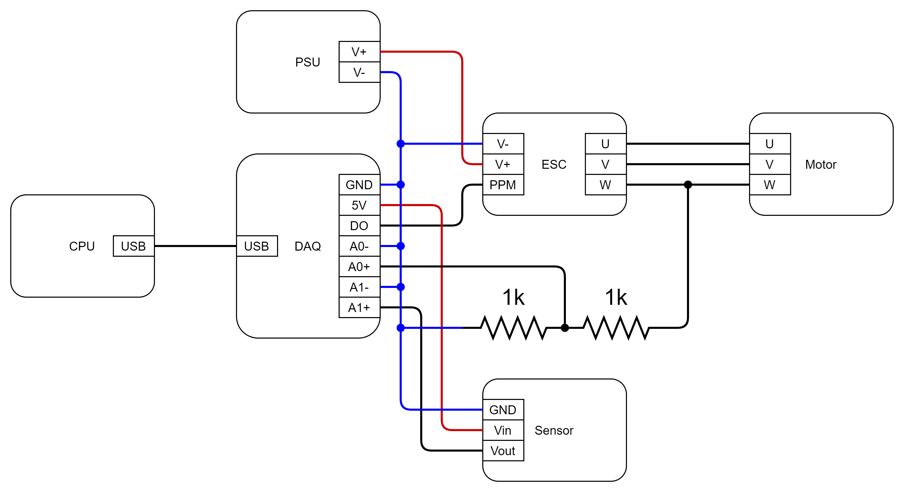

# Motor vibration analysis 

The repository is divided in two projects:
- A Python vibration capture and offline analysis project.
- A LabVIEW realtime vibration capture and analysis project.

The projects operate on the following circuit:

But they should not be difficult to adapt to a different one.

The Python analysis code can run on the following data capture sample files: 
[16V_Step.npy](http://www.therandomwalk.org/data/motor_vibration_analysis/16V_Step.npy),
[16V_Sweep.npy](http://www.therandomwalk.org/data/motor_vibration_analysis/16V_Sweep.npy).

More info at this [link](https://therandomwalk.org/wp/motor-vibration-analysis/)